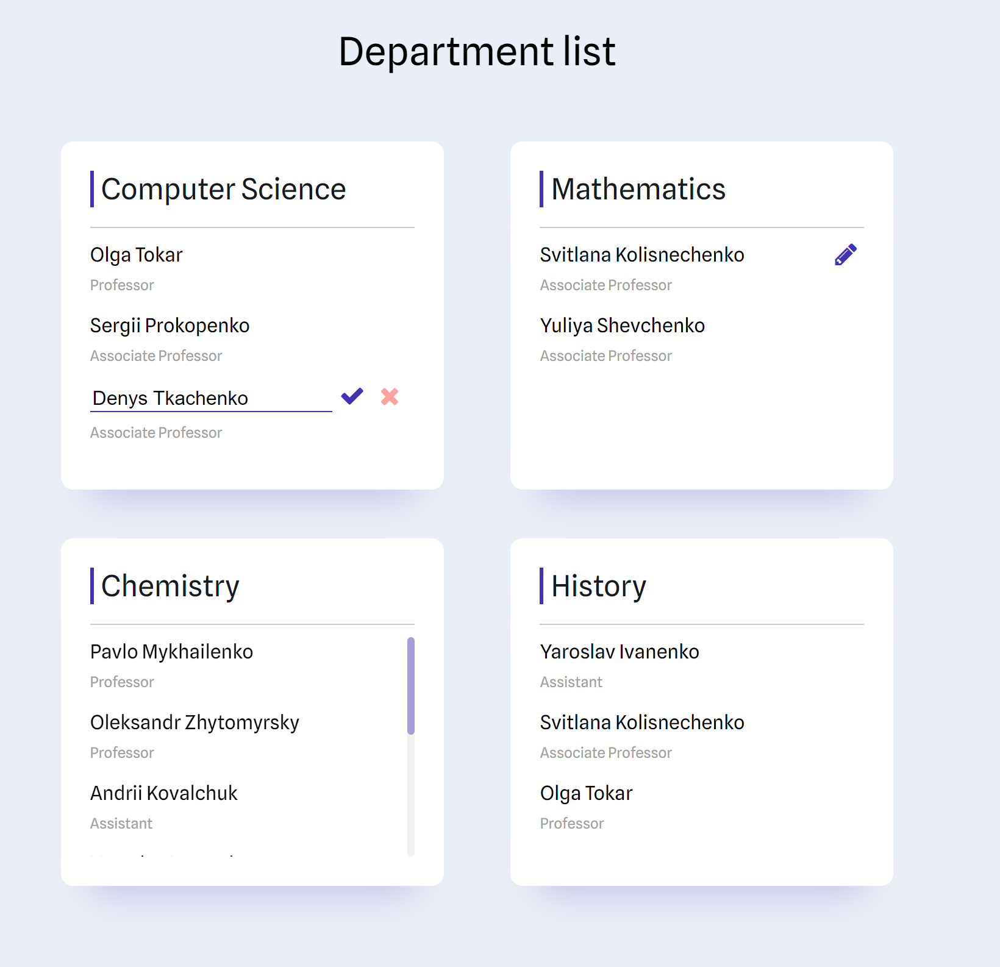

# University manager service

*A service for managing departments and lectors in the university*

## Steps to run
1. Clone the project with
   `git clone https://github.com/katerina20/uni-manage.git`
2. Go to the cloned project and build it with `./mvnw clean package`

### Run with docker:

3. Build docker compose `docker-compose build .`
4. Up the app with `docker-compose up -d`
5. `docker-compose down` stops the services.

### Run separate:
3. Be sure you have mongo database run
4. Install React dependencies `npm install`
5. Run client app `npm start`
6. Copy .jar file to current repo `cp ./target/uni-manage-0.0.1-SNAPSHOT.jar ./server.jar`
7. Run server app `java -jar server.jar`


Client is available by `http://localhost:3000`
Server is available by `http://localhost:8080`

## Server Endpoints

### Department

<details>
  <summary><strong>Get Departments</strong></summary>

**Endpoint:**
GET /department

**Description:**
This endpoint retrieves a list of all departments.

**Response:**
```json
[
  {
    "id": "string",
    "name": "string"
    "lectors": 
    [
       {
          "id": "string",
          "name": "string",
          "degree": "string"
       },
       // Additional lectors
    ]
  },
  // Additional departments
]
```
</details>

<details>
  <summary><strong>Get Department Statistics</strong></summary>

**Endpoint:**
GET /department/{department_id}/statistics

**Description:**
This endpoint retrieves statistics for a specific department.

**Path Parameters:**
`department_id`: The unique identifier of the department.

**Response:**
```json
{
   "ASSOCIATE_PROFESSOR": "number",
   "PROFESSOR": "number",
   "ASSISTANT": "number"
}
```
</details>

### Lector

<details>
  <summary><strong>Promote Lector</strong></summary>

**Endpoint:**
PUT /lector/{lector_id}/promote

**Description:**
This endpoint promotes a lector to a higher position.

**Path Parameters:**
`lector_id`: The unique identifier of the lector.

**Response**

**Status Code:** 200 OK or 400 Bad Request if the promotion fails.
</details>

<details>
  <summary><strong>Change Lector Name</strong></summary>

**Endpoint:**
PATCH /lector/{lector_id}/change-name?newName={newName}

**Description:**
This endpoint changes the name of a lector.

**Path Parameters:**
`lector_id`: The unique identifier of the lector.

**Request Parameters:**
`newName (QueryParam)`: The new name for the lector.

**Response**

**Status Code:** 200 OK or 400 Bad Request if the promotion fails.
</details>

### Lector Search

<details>
  <summary><strong>Search Lectors</strong></summary>

**Endpoint:**
GET /search?query={query}

**Description:**
This endpoint searches for lectors based on a query.

**Query Parameters:**
`query`: The search query.

**Response:**
```json
[
   "lector_name_1",
   "lector_name_2",
   // Other lector names
]
```
</details>

## UI

Displays Departments and list of lectors.
The lector's name can be modified.

